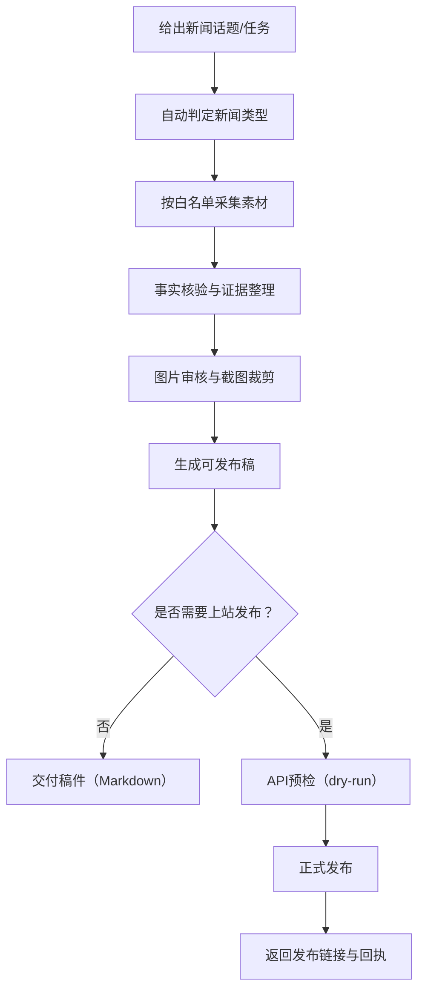
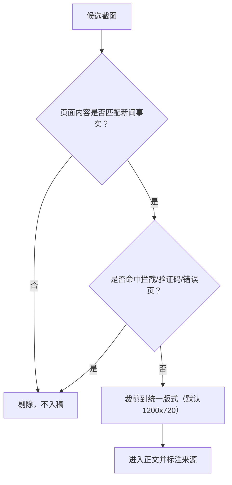

# 新闻技能工作台（非技术同事版）

> 这份文档给采编、研究、运营同事使用。  
> 目标：少看命令，重点看“要给什么、会产出什么、如何发布”。

---

## 1. 这个项目能做什么？

它可以把新闻工作流程标准化：
- 自动判断新闻类型（简报/深度/采访/实时/人物）
- 按数据源白名单搜集素材并做事实核验
- 对网页截图做内容审核与统一裁剪（防止错误截图入稿）
- 生成可发布稿（图文排版）
- 一键发布到网站（当前已接入 `lca-echo`）

---

## 2. 一图看懂全流程



---

## 3. 图片审核规则（重点）



---

## 4. 你只需要提供这几项

每次提需求尽量包含：
1. 新闻话题（你要写什么）
2. 目标读者（给谁看）
3. 期望类型（可不填，系统可自动判）
4. 是否要发布到网站（是/否）
5. 截止时间

可直接复制这段：

```text
请写一篇关于【话题】的新闻稿，
目标读者是【读者】，
新闻类型【可选：简报/深度/专题采访/实时/人物，或写“自动判断”】，
是否发布到网站【是/否】，
截止时间【日期时间】。
```

---

## 5. 你会收到什么结果

- 一份可读、可发布的新闻正文
- 图片与来源说明（含 `source_id`）
- 核验摘要（哪些已核实、哪些待补充）
- 若已发布：返回发布链接与回执（post_id）

---

## 6. 发布方式（最简）

非技术同事只需说一句：

> “请把这篇稿件发布到 lca-echo，并给我发布链接。”

系统会自动执行预检与发布，并回传结果。

---

## 7. 常见问题

- **为什么有些图会被删除？**  
  因为命中了拦截页/验证码/错误页，和新闻事实无关，必须剔除。

- **为什么要裁剪图片？**  
  为了统一版式，避免发布页显示不齐或错位。

- **我不想管新闻类型怎么办？**  
  直接写“自动判断”，系统会先做类型路由再写稿。

